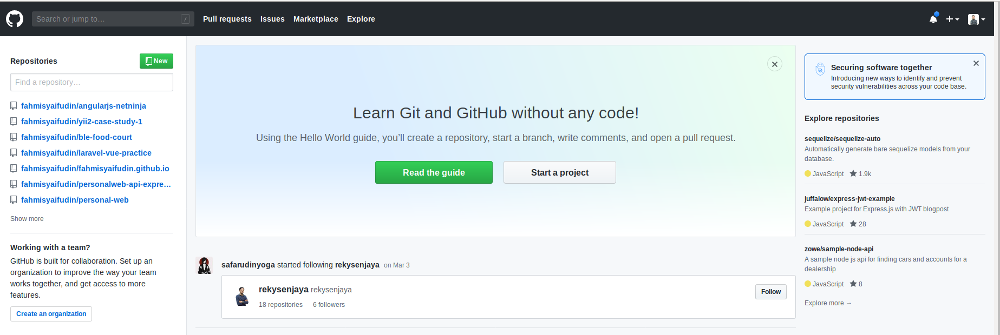
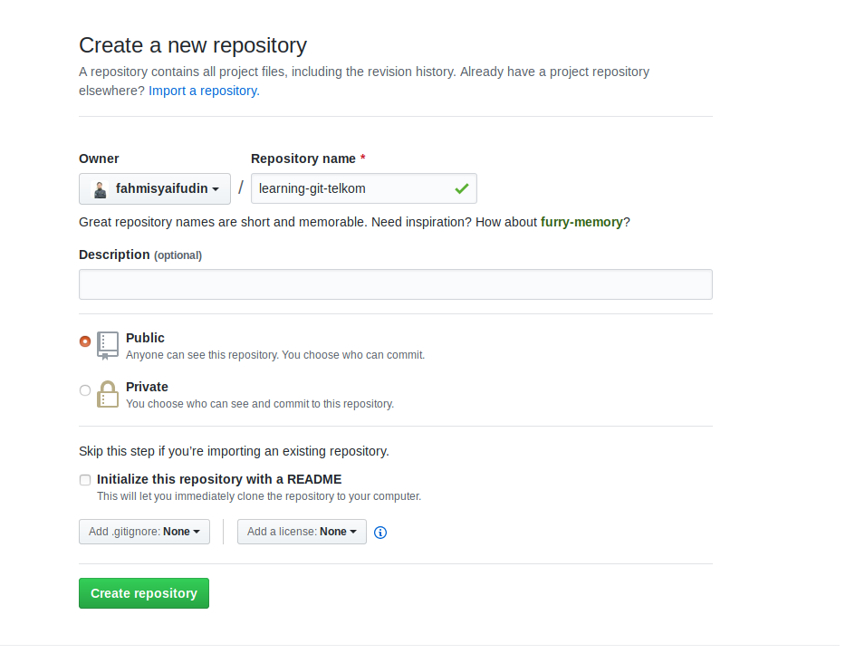
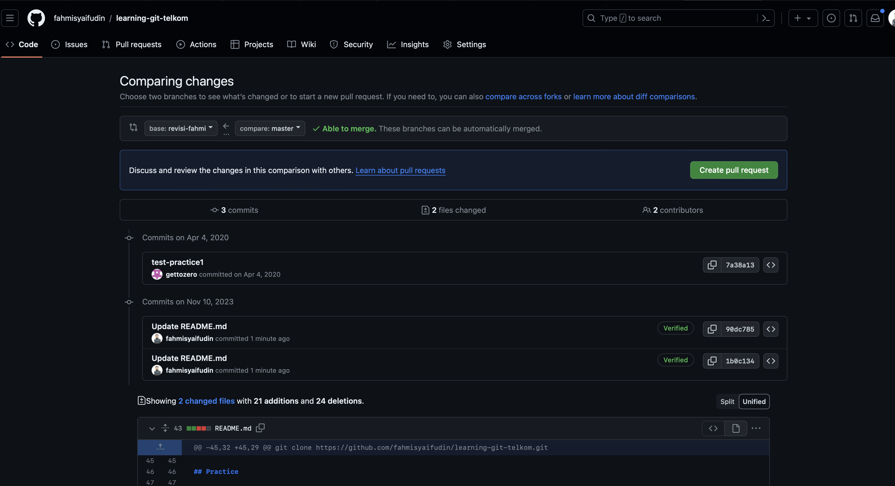

# Belajar Git Telkom Web Developer

## Install GIT

Linux 

```bash
apt-get install git
```
Windows [Download](https://git-scm.com/download/win)

Konfigurasi Awal

```bash
git config --global user.name "Fahmi Syaifudin"
git config --global user.email fahmisyaifudin@example.com
```

## Membuat Repository Awal di Github

1. Klik New Repository



2. Berikan nama dan deskripsi (optional) pada repository, centang public/private, aku centang public agar repository ini bisa diakses semua orang



3. Tulis perintah berikut pada Git bash (windows), terminal (linux)

```bash
git init
git add .
git commit -m "initial commit"
git remote add origin https://github.com/fahmisyaifudin/learning-git-telkom.git
git push origin master
```
(sesuaikan dengan nama project sampeyan ya...)

## Clone (Mengambil Repository dari Github)

git clone https://github.com/fahmisyaifudin/learning-git-telkom.git

(kita pakek https aja ya)
                
## Practice

1. Silahkan fork project ini https://github.com/fahmisyaifudin/learning-git-telkom.git
2. Clone ke laptop kalian
   git clone https://github.com/<username>/learning-git-telkom.git
3. Buat branch baru beri nama "feature/namakalian"

```bash
git checkout -b "feature/namakalian"
```
4. Tambahkan Perubahan pada PANITIA.md dan tulis nama kalian disitu
5. Commit dan push ke branch "feature/namakalian"
   
```bash
git add .
git commit -m "initial commit"
git push origin feature/namakalian
```
6. Lakukan pull request kayak contoh dibawah ini


7. jika ada pesan conflict saat melakukan pull request lakukan rebase/merge
  ```bash
git checkout master
git pull origin master
git checkout feature/namakalian
git rebase master 
```
